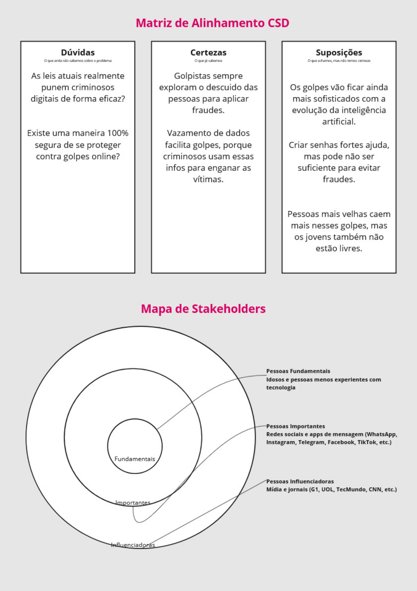
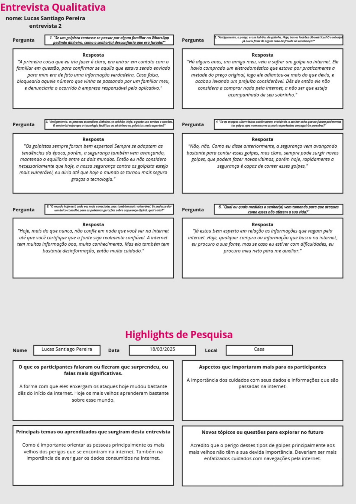
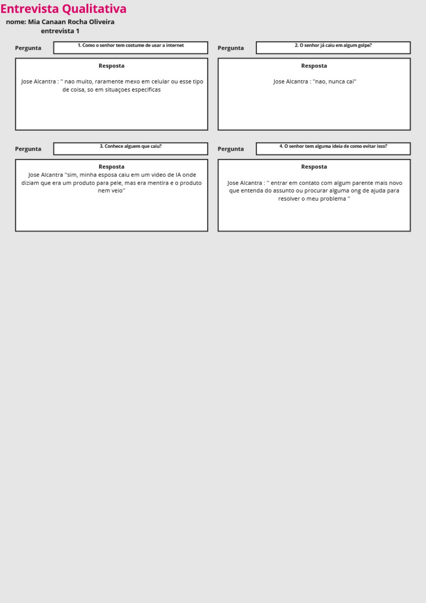
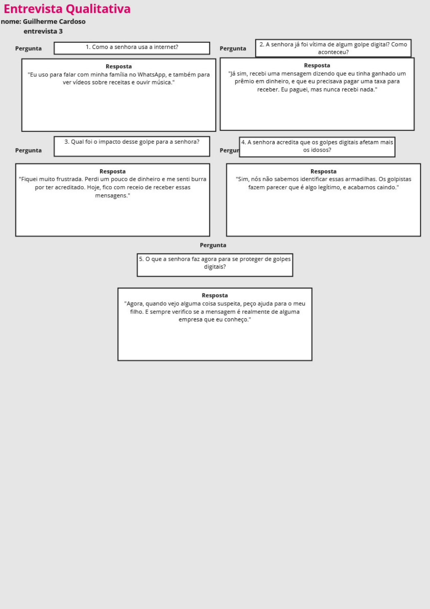
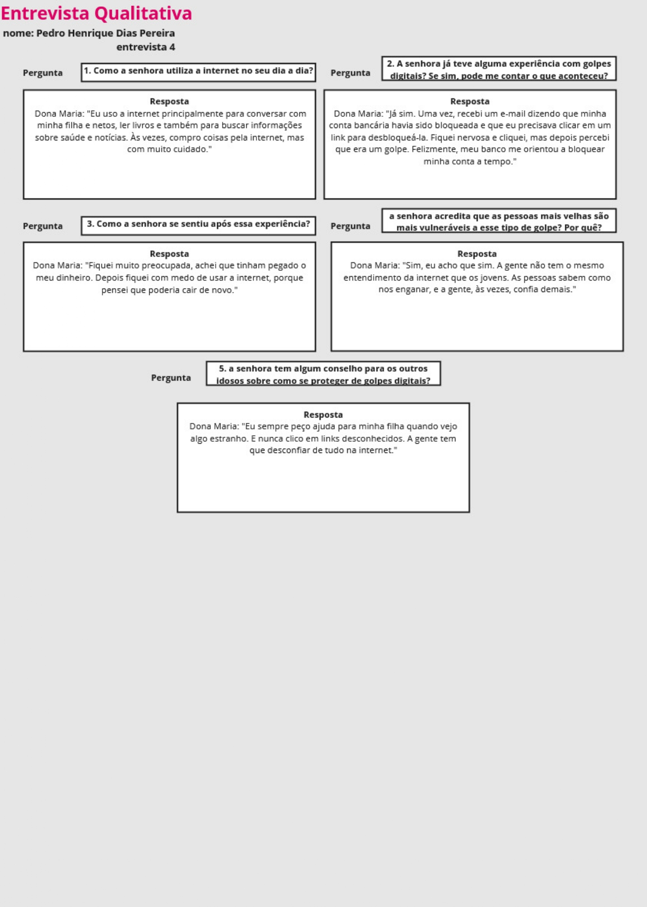
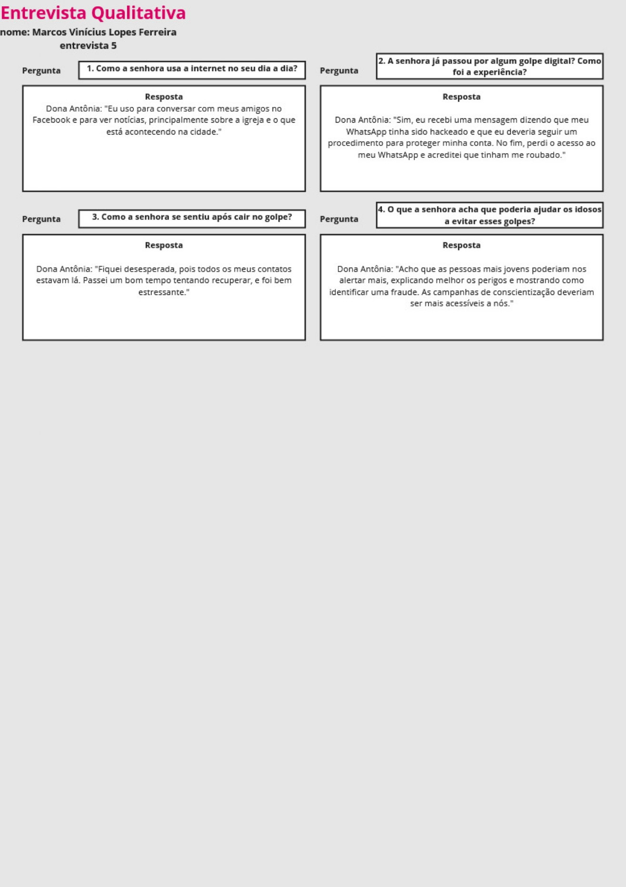
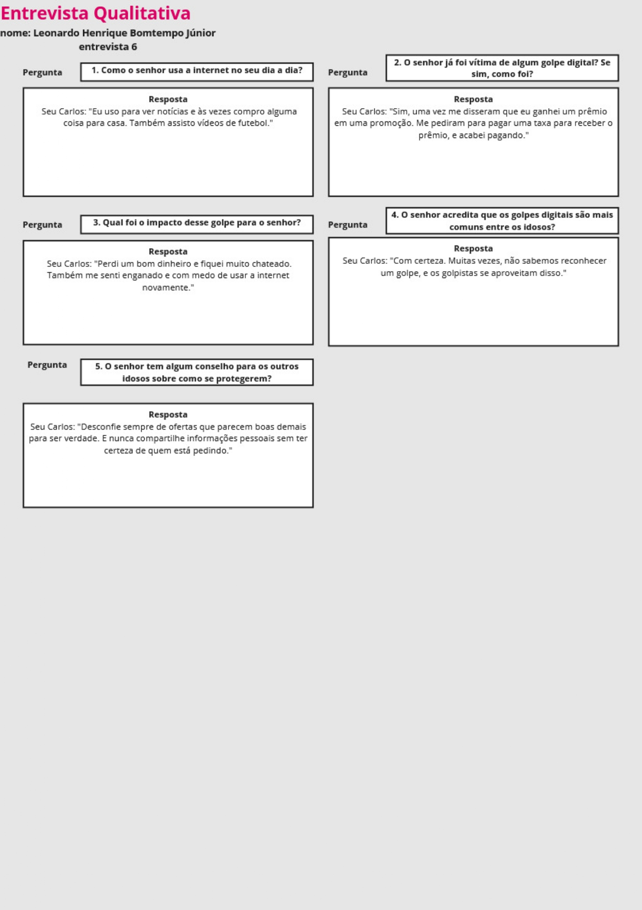
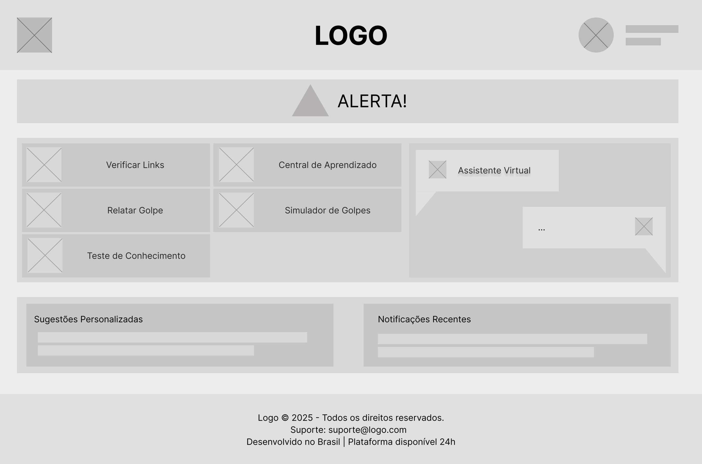
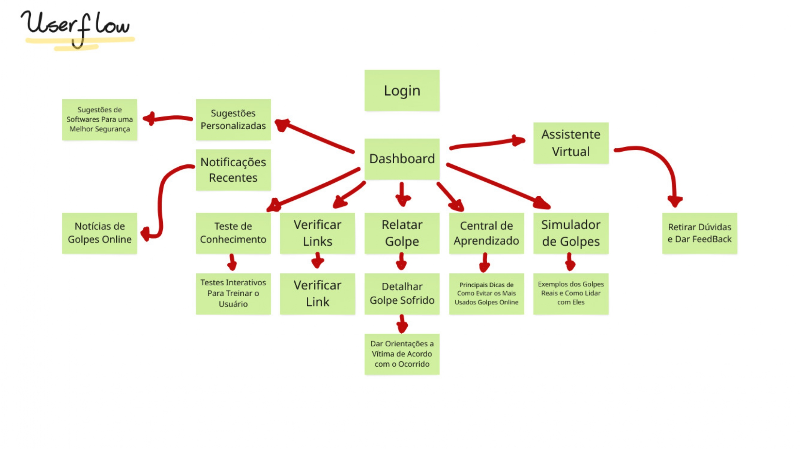

# Introdução

Informações básicas do projeto.

* **Projeto:** Web Security
* **Repositório GitHub:** [https://github.com/ICEI-PUC-Minas-CC-TI/ti1-2025-1-tarde-grupo-de-projeto-4]
* **Membros da equipe:**

  * Lucas Santiago
  * Guilherme Cardoso
  * Leonardo Bomtempo
  * Pedro Henrique
  * Marcos Vinicius
  * Mia Canaan

A documentação do projeto é estruturada da seguinte forma:

1. Introdução
2. Contexto
3. Product Discovery
4. Product Design
5. Metodologia
6. Solução
7. Referências Bibliográficas

✅ [Documentação de Design Thinking (MIRO)](files/processo-dt.pdf)

# Contexto

Este projeto tem como objetivo desenvolver um site educativo e acessível para auxiliar idosos – e seus familiares e cuidadores – a reconhecer, prevenir e agir contra golpes digitais. Criaremos uma plataforma simples, intuitiva e com linguagem clara, que ajudará a mitigar os prejuízos financeiros e emocionais causados por fraudes online.

## Problema

Os golpes digitais direcionados aos idosos têm se tornado cada vez mais frequentes. Muitas vezes, esse público não possui a familiaridade necessária com a tecnologia, o que os torna vulneráveis a fraudes online, como golpes de phishing, falsas ofertas e esquemas de investimento fraudulentos. Tais fraudes exploram a falta de conhecimento digital, causando prejuízos significativos – tanto financeiros quanto emocionais.

Além disso, com o crescimento da internet e dos serviços digitais, os idosos enfrentam desafios para se adaptar a essa nova realidade. Criminosos aproveitam essa vulnerabilidade aplicando golpes como falsos boletos, mensagens fraudulentas e promessas enganosas. Em muitos casos, os idosos não sabem onde buscar ajuda ou como denunciar esses crimes.

## Objetivos

O principal objetivo deste projeto é desenvolver um site simples e intuitivo que ensine os idosos a identificar golpes digitais e adotar medidas preventivas. Entre os objetivos específicos, destacam-se:

- Educar: Fornecer conteúdos que esclareçam os riscos dos golpes digitais e ensinem a identificar fraudes.
- Prevenir: Oferecer dicas práticas e exemplos reais para reduzir a vulnerabilidade do público-alvo.
- Orientar: Disponibilizar informações sobre como agir em caso de tentativa de golpe, com links para canais de denúncia e suporte.

## Justificativa

A inclusão digital dos idosos é fundamental, mas deve vir acompanhada de medidas de segurança. Muitas iniciativas se concentram apenas em ensinar o uso básico da internet, ignorando os riscos associados. Nosso projeto preenche essa lacuna, oferecendo informações essenciais para prevenir golpes e proteger uma parcela da população que, apesar de estar cada vez mais conectada, ainda é suscetível a fraudes.

## Público-Alvo

O projeto é direcionado principalmente para idosos acima de 60 anos – tanto aqueles que estão iniciando sua experiência na internet quanto os que já têm alguma familiaridade, mas ainda podem ser enganados. Adicionalmente, o conteúdo será útil para familiares e cuidadores, que necessitam orientar os idosos sobre práticas seguras no ambiente digital.

# Product Discovery

## Etapa de Entendimento








## Etapa de Definição

### Personas e Proposta de Valor


# Product Design

Nesse momento, vamos transformar os insights e validações obtidos em soluções tangíveis e utilizáveis. Essa fase envolve a definição de uma proposta de valor, detalhando a prioridade de cada ideia e a consequente criação de wireframes, mockups e protótipos de alta fidelidade, que detalham a interface e a experiência do usuário.

## Histórias de Usuários


## Requisitos


## Projeto de Interface

Artefatos relacionados com a interface e a interacão do usuário na proposta de solução.

### Wireframes

Esta seria a tela principal do nosso projeto.



### User Flow

Fluxo de Usuário



### Protótipo Interativo

**✳️✳️✳️ COLOQUE AQUI UM IFRAME COM SEU PROTÓTIPO INTERATIVO ✳️✳️✳️**

✅ [Protótipo Interativo (MarvelApp)](https://marvelapp.com/prototype/4hd6091?emb=1&iosapp=false&frameless=false)  ⚠️ EXEMPLO ⚠️

> ⚠️ **APAGUE ESSA PARTE ANTES DE ENTREGAR SEU TRABALHO**
>
> Um protótipo interativo apresenta o projeto de interfaces e permite ao usuário navegar pelas funcionalidades como se estivesse lidando com o software pronto. Utilize as mesmas ferramentas de construção de wireframes para montagem do seu protótipo interativo. Inclua o link para o protótipo interativo do projeto.

# Metodologia

O projeto foi desenvolvido utilizando práticas de Design Thinking e metodologias ágeis. Foram realizadas entrevistas qualitativas e levantamentos para entender os desafios enfrentados pelo público-alvo. O gerenciamento do projeto seguiu o framework Scrum, permitindo uma rápida adaptação às necessidades identificadas durante a pesquisa.

### Ferramentas Utilizadas

| Ambiente                    | Plataforma | Link de acesso                                     |
| --------------------------- | ---------- | -------------------------------------------------- |
| Processo de Design Thinking | Miro       | [Acesse o Miro](https://miro.com/app/board/uXjVIPJsGsI=/)           |
| Repositório de código       | GitHub     | [Acesse o GitHub](https://github.com/ICEI-PUC-Minas-CC-TI/ti1-2025-1-tarde-grupo-de-projeto-4)        |

## Gerenciamento do Projeto

Divisão de papéis no grupo e apresentação da estrutura da ferramenta de controle de tarefas (Kanban).


> ⚠️ **APAGUE ESSA PARTE ANTES DE ENTREGAR SEU TRABALHO**
>
> Nesta parte do documento, você deve apresentar  o processo de trabalho baseado nas metodologias ágeis, a divisão de papéis e tarefas, as ferramentas empregadas e como foi realizada a gestão de configuração do projeto via GitHub.
>
> Coloque detalhes sobre o processo de Design Thinking e a implementação do Framework Scrum seguido pelo grupo. O grupo poderá fazer uso de ferramentas on-line para acompanhar o andamento do projeto, a execução das tarefas e o status de desenvolvimento da solução.
>
> **Orientações**:
>
> - [Sobre Projects - GitHub Docs](https://docs.github.com/pt/issues/planning-and-tracking-with-projects/learning-about-projects/about-projects)
> - [Gestão de projetos com GitHub | balta.io](https://balta.io/blog/gestao-de-projetos-com-github)
> - [(460) GitHub Projects - YouTube](https://www.youtube.com/playlist?list=PLiO7XHcmTsldZR93nkTFmmWbCEVF_8F5H)
> - [11 Passos Essenciais para Implantar Scrum no seu Projeto](https://mindmaster.com.br/scrum-11-passos/)
> - [Scrum em 9 minutos](https://www.youtube.com/watch?v=XfvQWnRgxG0)

# Solução Implementada

Esta seção apresenta todos os detalhes da solução criada no projeto.

## Vídeo do Projeto

O vídeo a seguir traz uma apresentação do problema que a equipe está tratando e a proposta de solução. ⚠️ EXEMPLO ⚠️

[](https://www.youtube.com/embed/70gGoFyGeqQ)

> ⚠️ **APAGUE ESSA PARTE ANTES DE ENTREGAR SEU TRABALHO**
>
> O video de apresentação é voltado para que o público externo possa conhecer a solução. O formato é livre, sendo importante que seja apresentado o problema e a solução numa linguagem descomplicada e direta.
>
> Inclua um link para o vídeo do projeto.

## Funcionalidades

Esta seção apresenta as funcionalidades da solução.Info

##### Funcionalidade 1 - Cadastro de Contatos ⚠️ EXEMPLO ⚠️

Permite a inclusão, leitura, alteração e exclusão de contatos para o sistema

* **Estrutura de dados:** [Contatos](#ti_ed_contatos)
* **Instruções de acesso:**
  * Abra o site e efetue o login
  * Acesse o menu principal e escolha a opção Cadastros
  * Em seguida, escolha a opção Contatos
* **Tela da funcionalidade**:


> ⚠️ **APAGUE ESSA PARTE ANTES DE ENTREGAR SEU TRABALHO**
>
> Apresente cada uma das funcionalidades que a aplicação fornece tanto para os usuários quanto aos administradores da solução.
>
> Inclua, para cada funcionalidade, itens como: (1) titulos e descrição da funcionalidade; (2) Estrutura de dados associada; (3) o detalhe sobre as instruções de acesso e uso.

## Estruturas de Dados

Descrição das estruturas de dados utilizadas na solução com exemplos no formato JSON.Info

##### Estrutura de Dados - Contatos   ⚠️ EXEMPLO ⚠️

Contatos da aplicação

```json
  {
    "id": 1,
    "nome": "Leanne Graham",
    "cidade": "Belo Horizonte",
    "categoria": "amigos",
    "email": "Sincere@april.biz",
    "telefone": "1-770-736-8031",
    "website": "hildegard.org"
  }
  
```

##### Estrutura de Dados - Usuários  ⚠️ EXEMPLO ⚠️

Registro dos usuários do sistema utilizados para login e para o perfil do sistema

```json
  {
    id: "eed55b91-45be-4f2c-81bc-7686135503f9",
    email: "admin@abc.com",
    id: "eed55b91-45be-4f2c-81bc-7686135503f9",
    login: "admin",
    nome: "Administrador do Sistema",
    senha: "123"
  }
```

> ⚠️ **APAGUE ESSA PARTE ANTES DE ENTREGAR SEU TRABALHO**
>
> Apresente as estruturas de dados utilizadas na solução tanto para dados utilizados na essência da aplicação quanto outras estruturas que foram criadas para algum tipo de configuração
>
> Nomeie a estrutura, coloque uma descrição sucinta e apresente um exemplo em formato JSON.
>
> **Orientações:**
>
> * [JSON Introduction](https://www.w3schools.com/js/js_json_intro.asp)
> * [Trabalhando com JSON - Aprendendo desenvolvimento web | MDN](https://developer.mozilla.org/pt-BR/docs/Learn/JavaScript/Objects/JSON)

## Módulos e APIs

Esta seção apresenta os módulos e APIs utilizados na solução

**Images**:

* Unsplash - [https://unsplash.com/](https://unsplash.com/) ⚠️ EXEMPLO ⚠️

**Fonts:**

* Icons Font Face - [https://fontawesome.com/](https://fontawesome.com/) ⚠️ EXEMPLO ⚠️

**Scripts:**

* jQuery - [http://www.jquery.com/](http://www.jquery.com/) ⚠️ EXEMPLO ⚠️
* Bootstrap 4 - [http://getbootstrap.com/](http://getbootstrap.com/) ⚠️ EXEMPLO ⚠️

> ⚠️ **APAGUE ESSA PARTE ANTES DE ENTREGAR SEU TRABALHO**
>
> Apresente os módulos e APIs utilizados no desenvolvimento da solução. Inclua itens como: (1) Frameworks, bibliotecas, módulos, etc. utilizados no desenvolvimento da solução; (2) APIs utilizadas para acesso a dados, serviços, etc.

# Referências

As referências utilizadas no trabalho foram:

* SOBRENOME, Nome do autor. Título da obra. 8. ed. Cidade: Editora, 2000. 287 p ⚠️ EXEMPLO ⚠️

> ⚠️ **APAGUE ESSA PARTE ANTES DE ENTREGAR SEU TRABALHO**
>
> Inclua todas as referências (livros, artigos, sites, etc) utilizados no desenvolvimento do trabalho.
>
> **Orientações**:
>
> - [Formato ABNT](https://www.normastecnicas.com/abnt/trabalhos-academicos/referencias/)
> - [Referências Bibliográficas da ABNT](https://comunidade.rockcontent.com/referencia-bibliografica-abnt/)
